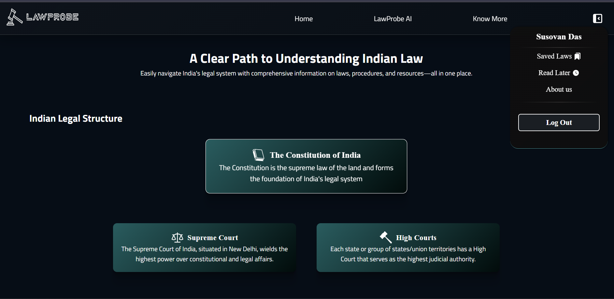
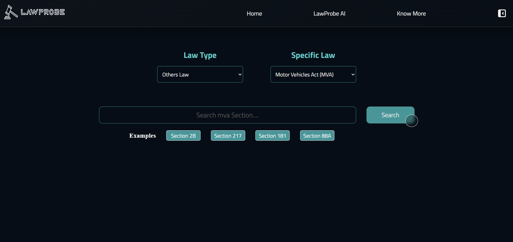
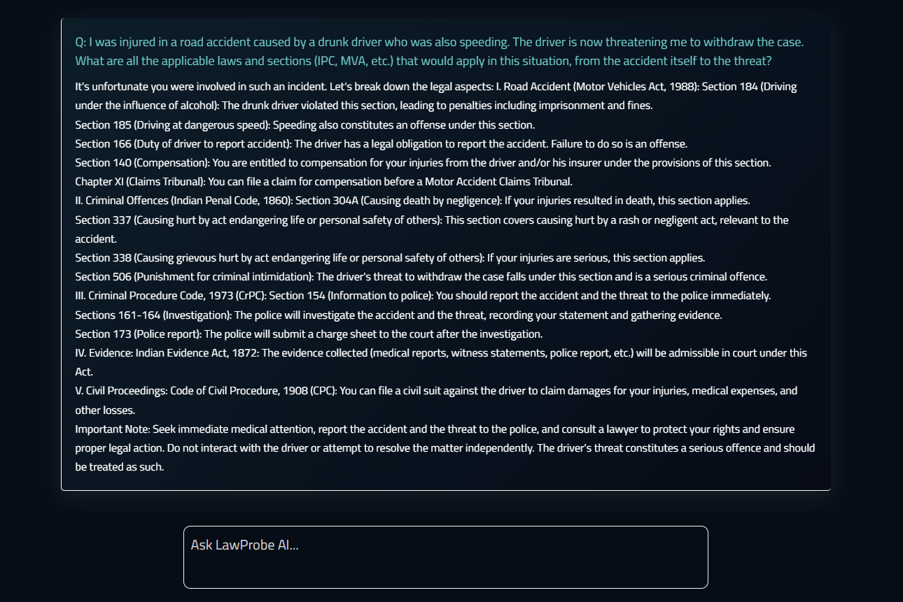

# LawProbe - Your AI-Powered Legal Assistant ⚖️

A full-stack web application designed to provide users with seamless access to various Indian laws and a conversational AI for instant legal queries.
#### 🌐 https://www.lawprobe.xyz

## ✨ Key Features

* **🤖 AI-Powered Legal Assistant:** Integrated with the Google Gemini API to offer a sophisticated chatbot that answers complex legal questions in a structured, easy-to-understand format.
* **📚 Comprehensive Law Database:** Efficiently fetches and displays specific sections from a wide range of Indian laws, including:
    * Indian Penal Code (IPC)
    * Code of Criminal Procedure (CrPC)
    * Civil Procedure Code (CPC)
    * Indian Evidence Act (IEA)
    * Indian Divorce Act (IDA)
    * Motor Vehicles Act (MVA)
* **🔐 Secure User Authentication:** Features a robust user registration and login system using JWT for session management and `bcrypt` for password hashing.
* **👤 Personalized User Library:** Allows authenticated users to save important law sections for future reference and mark others to "Read Later," creating a personalized legal dashboard.
* **✅ Secure & Validated API:** Backend routes are protected and validated using `Zod` to ensure data integrity and type safety for all incoming requests.
* **📨 User Feedback System:** Includes a contact form for users to send messages or inquiries, which are securely stored in the database.

***

## 🛠️ Tech Stack & Architecture

* **Frontend:**
    * **React:** For building a dynamic and responsive user interface.
    * **Recoil:** For efficient and predictable state management.
    * **Axios:** To handle all HTTP requests to the backend API.
    * **CSS:** For custom styling and a polished user experience.

* **Backend:**
    * **Node.js & Express.js:** To build a scalable and efficient RESTful API.
    * **MongoDB & Mongoose:** As the NoSQL database for storing all application data.
    * **JSON Web Tokens (JWT):** For implementing secure user authentication.
    * **Bcrypt:** For hashing user passwords to ensure data security.
    * **Zod:** For validating and ensuring the correctness of API request bodies.

* **Deployment & DevOps:**
    * **Cloud Hosting:** **AWS (Amazon Web Services)** for scalable and reliable hosting.
    * **Reverse Proxy:** **Nginx** to manage incoming traffic and serve static files.
    * **CDN:** **Bunny.net** to globally cache and deliver assets for faster load times.
    * **Process Management:** **PM2** to keep the Node.js application alive and manage processes efficiently.

***
## Preview 👀

  
  
  

